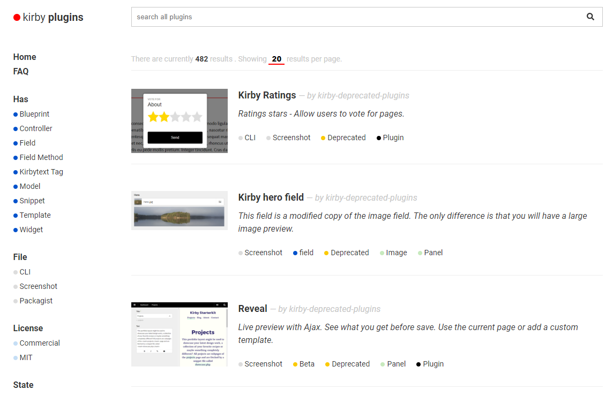

# Kirby Plugins

**The unofficial **[plugin list](https://github.com/jenstornell/kirby-plugins/issues)** for [Kirby CMS](https://getkirby.com/).**

In this repository a plugin is anything related to Kirby, that is not a theme.

## Tool to find plugins

[@heroheman](https://github.com/heroheman) has created a tool that makes it very easy to find the plugin that you are looking for.

If you don't want to use the tool above, you can [search in the issues](https://github.com/jenstornell/kirby-plugins/issues). If that does not work, you can browse the labels below.

## Labels

Every plugin has one or more [labels](https://github.com/jenstornell/kirby-plugins/labels). It makes it easier to find what you are looking for in the search, but it does also make it easier to browse for plugins.

Below you can see the label groups including the labels. The only label group not listed is [Tag](https://github.com/jenstornell/kirby-plugins/labels?utf8=%E2%9C%93&q=Tag%3A+) because it includes so many labels which will change a lot.

### **Browse by:** File

Browse plugins by files included in the plugin repository:

 [CLI](https://github.com/jenstornell/kirby-plugins/labels/File%3A%20CLI) 
 [Screenshot](https://github.com/jenstornell/kirby-plugins/labels/File%3A%20Screenshot) 
 [Packagist](https://github.com/jenstornell/kirby-plugins/labels/File%3A%20Packagist)

### **Browse by:** Has

Browse plugins by the things it has registered:

 [Blueprint](https://github.com/jenstornell/kirby-plugins/labels/Has%3A%20blueprint) 
 [Controller](https://github.com/jenstornell/kirby-plugins/labels/Has%3A%20controller) 
 [Field](https://github.com/jenstornell/kirby-plugins/labels/Has%3A%20field) 
 [Field Method](https://github.com/jenstornell/kirby-plugins/labels/Has%3A%20fieldMethod) 
 [Kirbytext Tag](https://github.com/jenstornell/kirby-plugins/labels/Has%3A%20kirbytextTag) 
 [Model](https://github.com/jenstornell/kirby-plugins/labels/Has%3A%20model) 
 [Snippet](https://github.com/jenstornell/kirby-plugins/labels/Has%3A%20snippet) 
 [Template](https://github.com/jenstornell/kirby-plugins/labels/Has%3A%20template) 
 [Widget](https://github.com/jenstornell/kirby-plugins/labels/Has%3A%20widget)

### **Browse by:** License

 [Commercial](https://github.com/jenstornell/kirby-plugins/labels/License%3A%20Commercial) 
 [MIT](https://github.com/jenstornell/kirby-plugins/labels/License%3A%20MIT)

### **Browse by:** State

 [Beta](https://github.com/jenstornell/kirby-plugins/labels/State%3A%20Beta) 
 [Broken](https://github.com/jenstornell/kirby-plugins/labels/State%3A%20Broken) 
 [Deprecated](https://github.com/jenstornell/kirby-plugins/labels/State%3A%20Deprecated)

### **Browse by:** Type

Not all things in this repository are plugins. Browse by which type they are:

 [Plugin](https://github.com/jenstornell/kirby-plugins/labels/Type%3A%20Plugin) 
 [Core](https://github.com/jenstornell/kirby-plugins/labels/Type%3A%20Core) 
 [Tutorial](https://github.com/jenstornell/kirby-plugins/labels/Type%3A%20Tutorial) 
 [Misc](https://github.com/jenstornell/kirby-plugins/labels/Type%3A%20Misc)

### **Browse by:** Version

 [Version 2](https://github.com/jenstornell/kirby-plugins/labels/Version%3A%202) 
 [Version 3](https://github.com/jenstornell/kirby-plugins/labels/Version%3A%203)

<!--
### Label groups

- [Kirby versions](https://github.com/jenstornell/kirby-plugins/labels?utf8=%E2%9C%93&q=version)
- [Media](https://github.com/jenstornell/kirby-plugins/labels?utf8=%E2%9C%93&q=media)
- [Panel](https://github.com/jenstornell/kirby-plugins/labels?utf8=%E2%9C%93&q=panel)
- [SEO](https://github.com/jenstornell/kirby-plugins/labels?utf8=%E2%9C%93&q=seo)

-->

## Submit a plugin

1. [Search](https://github.com/jenstornell/kirby-plugins/issues) for the plugin to make sure it does not already exist.
1. [Add the plugin](https://github.com/jenstornell/kirby-plugins/issues/new).
1. Don't close the issue.

You can only add labels if you are a collaborator. I can change the privileges when needed.

## Report a plugin

If the plugin is **broken**, is **malware** or is **duplicate** (already exists in the plugin list), add a comment in the plugin issue. If others agree, we can label it. Don't close the issue!

## Requirements

The requirement for using these plugins is Kirby 2. If you are still using Kirby 1 (which is now deprecated) we encourage you to update for compatibility and security reasons.

## Responsibility

This repository does not take any responsibility for the harm the plugins can do. 

## Kirby themes

**[Kirby themes](https://github.com/jenstornell/kirby-themes)** - the unofficial [theme list](https://github.com/jenstornell/kirby-themes/issues) for Kirby CMS.

## Special thanks to

I would like to give a special thanks to @aoimedia that has been deeply involved in this thing. I would also like to thank everyone that contributes to this repo, one way or the other.
